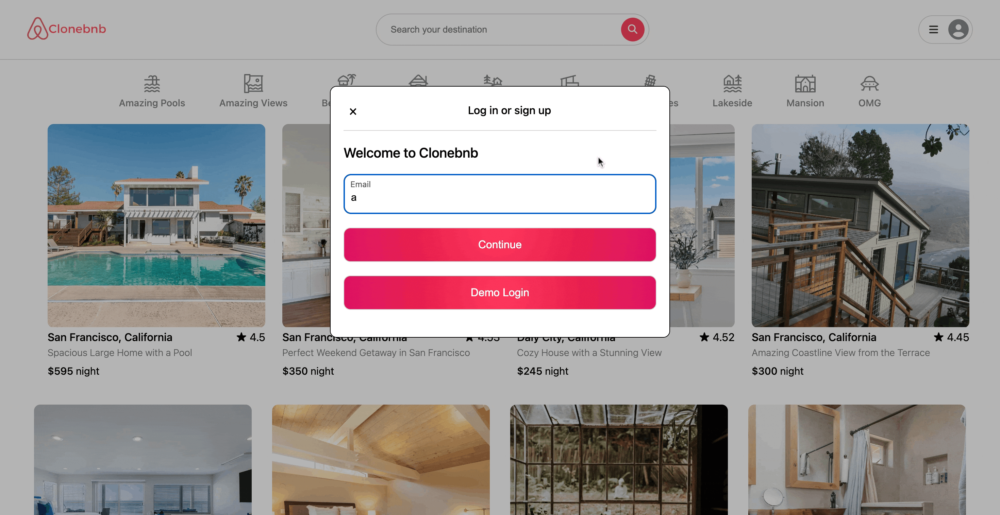
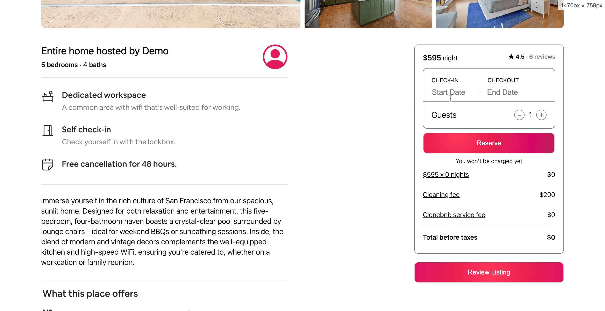

# Clonebnb

Clonebnb is an Airbnb clone featuring the ability to sign up, book reservations, and review listings. Addtionally, users can update and delete their reviews and reservations (reservations can only be updated or deleted if they have not taken place yet).

# [LIVE](https://echang-clonebnb-1675d40c18ba.herokuapp.com/)

## Technologies

Clonebnb is built using Ruby on Rails on the backend and React and Redux on the frontend. The application also utilizes NPM packages such as React-Dates as well as Google Maps API integration.

### Backend
- Ruby on Rails

### Frontend
- React / Redux - Renders the user interface. Redux is utilized to manage the application's state.
- React Dates Library - Used for the calendar when making/viewing a reservation.
- Moment.js - Used in conjunction with React Dates as a means of tracking dates and converting date formats between the backend and frontend.
- NPM - Manages the application's dependencies.

### Database
- PostgreSQL

### Map
- Google Maps API - Utilized to show users approximately where they'll be staying if they book this listing.

### Image Hosting
- AWS S3 - AWS S3 Buckets stores the listing images on AWS so that the images are not stored in the application.

### Web Design & Styling
- HTML & CSS

## Key Features

### User Authentication
- Users can signup for their own account with secure login and logout. The backend utilizes CSRF tokens to validate requests.
- Certain features can only be accessed if a user is logged in, although users can see all features without being logged in. A demo login is available for users to try out the sight.
- The ability to see the user profile with existing reviews and reservations can only be seen when logged in. Otherwise, clicking on the profile button in the NavBar only renders the signup or login buttons.



### Listing Show
- On a listing's show page, logged in users can create a reservation for that listing, as well as leave a review.
- Below the reviews index, Google Maps API is integrated showing the approximate location of the listing. Both these features include error handling that will not dispatch incomplete or invalid forms. 
- The calendar for the reservations was a little tricky, as I had to utilize ReactDates and moment, which are both libraries that I am unfamiliar with. Additionally, reviews had some styling and logic that I haven't used before, especially with all the radio buttons. I managed to limit the amount of code written with my reviews by creating an array with the ratings and looping through it. 
- React Dates took a lot of work upfront to learn, but after getting the hang of it, I actually ran into less issues with that than getting my review form working properly.
- On the home page, users can also filter listings by the category bar below the NavBar, as well as utilize the search in order to filter by city.



### Reservations & Reviews
The two full CRUD features on the application, which users are allowed to create, read, update, and destroy. The trickiest part I had with these can be traced to the forms as well as how to fetch related data. The forms were a lot more straightforward once the create was done, as the update form is very similar. I managed to work through the issues regarding related data by building out the Redux state using JBuilder. For example, when creating a reservation things like a listing's rating, price, etc. has to match Airbnb as well as generate the total calculated price for the number of nice a user sets in the reservation calendar. The price should change dynamically based on changing the start or end dates. 


```ruby
json.user do
    json.partial! '/api/users/user', user: @user
end

json.reviews do
    @user.reviews.each do |review|
        json.set! review.id do
            json.extract! review, :id, :listing_id, :user_id, :cleanliness, :communication, :check_in, :accuracy, :location, :value, :body

            json.first_name review.user.first_name
            json.listing_title review.listing.title
        end
    end
end

json.reservations do
    @user.reservations.each do |reservation|
        json.set! reservation.id do
            json.extract! reservation, :id, :listing_id, :user_id, :num_guests, :start_date, :end_date

            json.photoUrl url_for(reservation.listing.photos[0])
            json.city reservation.listing.city
            json.state reservation.listing.state
        end
    end
end
```

```javascript
    useEffect(() => {
        if (startDate && endDate) {
            const start = new Date(startDate);
            const end = new Date(endDate);
            const time = end.getTime() - start.getTime();
            const nights = time / (1000 * 3600 * 24)
            setNumNights(nights)
            
            const price = listing?.price * nights
            const fee = Math.round(((price + listing?.cleaningFee) * 0.08))
            setRawPrice(price)
            setServiceFee(fee)
            setTotalPrice(price + listing?.cleaningFee + fee)
        }
    }, [startDate, endDate, listing?.cleaningFee, listing?.price])
```
